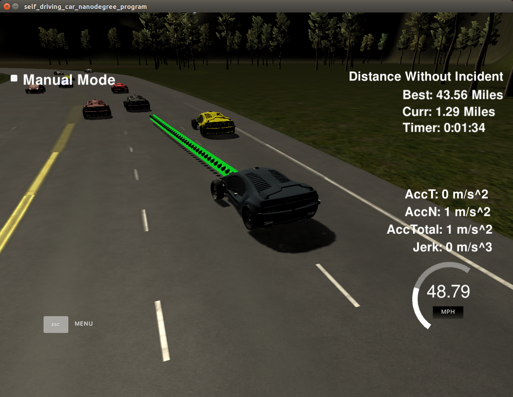

# CarND-Path-Planning-Project
Robbie Edwards Submission.  Self-Driving Car Engineer Nanodegree Program -

### Goals
(from the project description)

In this project your goal is to safely navigate around a virtual highway with other traffic that is driving +-10 MPH of the 50 MPH speed limit. You will be provided the car's localization and sensor fusion data, there is also a sparse map list of waypoints around the highway. The car should try to go as close as possible to the 50 MPH speed limit, which means passing slower traffic when possible, note that other cars will try to change lanes too. The car should avoid hitting other cars at all cost as well as driving inside of the marked road lanes at all times, unless going from one lane to another. The car should be able to make one complete loop around the 6946m highway. Since the car is trying to go 50 MPH, it should take a little over 5 minutes to complete 1 loop. Also the car should not experience total acceleration over 10 m/s^2 and jerk that is greater than 50 m/s^3.

## Basic Build Instructions

1. build directory: `cd build`
2. Compile: `cmake .. && make`
3. Run it: `./path_planning`.

Here is the data provided from the Simulator to the C++ Program

## Solution

The current solution appears to handle most driving scenarios in the simulator well. When left to run it typically acheives 18.5 miles of driving without incident. The best total distance has been 43.5 miles.  There are likely some corner cases that need tuning or debugging such as when another car makes a lane change while our car is changing lanes. There are also likely some limitations of the simulator and the code such as the slow response of the car having to consume its 50 waypoints before it can take a sudden action. It also has limits on acceleration which can decrease the response time to a sudden incident. It would take a large amount of testing to observe and fix all the corner cases as they only happen every 20 minutes on average. For the most part, the car performs well and drives smoothly.

### Smooth driving

Getting the car to drive smoothly was the subject of some pain. Transforming the s & d car coordinates into x & y global coordinates using the getXY function was not adequate. A solution similar to the project walkthrough using the spline librarcy was implemented after attempting some other methods.

1. Save 5 waypoints to fit a spline to. LINE 494 of main.cpp. This is done from the end of the previous path and not the car's coordinate. The 2 points from the previous trajectory are used to ensure tangency. 3 points ahead of the car are selected using s & d coordinates. The d coordinate is specified based on the desired lane, thus a smooth trajectory can be generated for lane changes.
  1. previous trajectory [-2]
  2. previous trajectory [-1]
  3. car's s position + 50m
    * 50m was selected to have acceptable jerk when changing lanes
  4. car's s position + 75m
  5. car's s position + 100m

2. Transform the 5 waypoints into the car's coordinates. LINE 525.
3. Fit a spline using the spline.h library in car frame coordinates. LINE 538
4. Determine the required point spacing to hit the require velocity in the simulator. LINE 574
5. Generate additional waypoints in car coordinates using the spline to fill the previous path of 47 points back to 50 points.
6. Transform these new points back to global coordinates and append them.

Velocity is managed by monitoring the previous velocity and adjusting it based on the max acceleration and timestep.

`v2 = v1 + a*dt`

Acceleration could have been integrated based on the max jerk and then the velocity integrated based on the accelration. This was attempted but found to be unecessary to meet requirements and it introduced lag in setting the velocity.

### Behavior

A basic state machine type solution was implemented to select the vehicle's speed and lane which were passed to the spline and waypoint generation section of the code. A relatively simple behavior selection state machine was found to be effective under almost all conditions. This is at LINE 343 of main.cpp.

1. Nominally keep the lane and set vel to 49MPH. `state = "KEEPLANE`
2. Review the sensor_fusion data for cars in our current lane.
  * Find the closest vehicle to us in our lane.
3. If we are within 25m (follow_dist), set our speed to that vehicle's speed. Set `state = "FOLLOW"`
  * If we are within 18m (safety_dist), decrease our speed to back off.
4. If we are in the FOLLOW state, check the lanes left and right.
  * Don't check lanes outside of boundaries.
  * review telemetry for the lanes beside us and determine the maximum available S distance between our car and the next car in the neighbor lane.
  * Only count this measurement if a lane change would be safe and there are no impending cars up -6m behind us in the neighbor lane. LINE 418, 447.
5. Perform a lane change into the lane with the most available driving space if there is enough room. LINE 460.
  * Don't perform a lane change if we are too close to the car in front of us.
  * Ensure there is 22m of free space in front in the target lane.
  * Ensure there are no cars 3m behind us in the target lane.
  * If there is not enough room to change, resume keeping the lane or following.

### Considerations and Improvements.

This path planner only considers changing a lane once it is in the FOLLOW state behind another car. It is subject to getting stuck in a "boxed in" situation with a car in the front and one beside it where it must wait. It is not capable of adjusting it's velocity to find its way out of this situtaion.

To resolve this the car could calculate the total free driving area in all opposing lanes at every iteration and change lanes based on the most free area in opposing lanes from any state, not just follow.

The car could use a form of prediction to calculate the future positions of itself and surrounding vehicles to ensure that there are not collisions for a potential trajectory.

The car is probably the most sensitive to trying to make a lane change while stuck behind a slow moving car. It only considers cars up to 6m behind it in the target lane. This makes it vunerable to a fast moving car from behind while changing lanes. The a prediction step could help here, or a larger rear monitoring distance, or checking the aft vehicle's speed. This doesn't occur often as we are often driving faster than other vehicles.

I have a feeling that planners and behavior engines in commercial grade robotics and self driving cars are not built on IF statements as it was done here. Perhaps more-so based on cost functions / cost maps.
